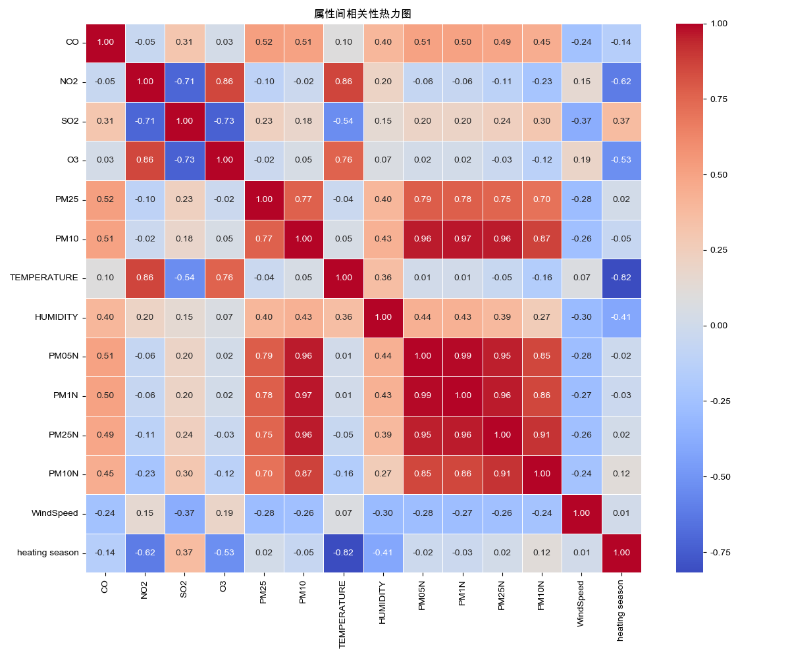
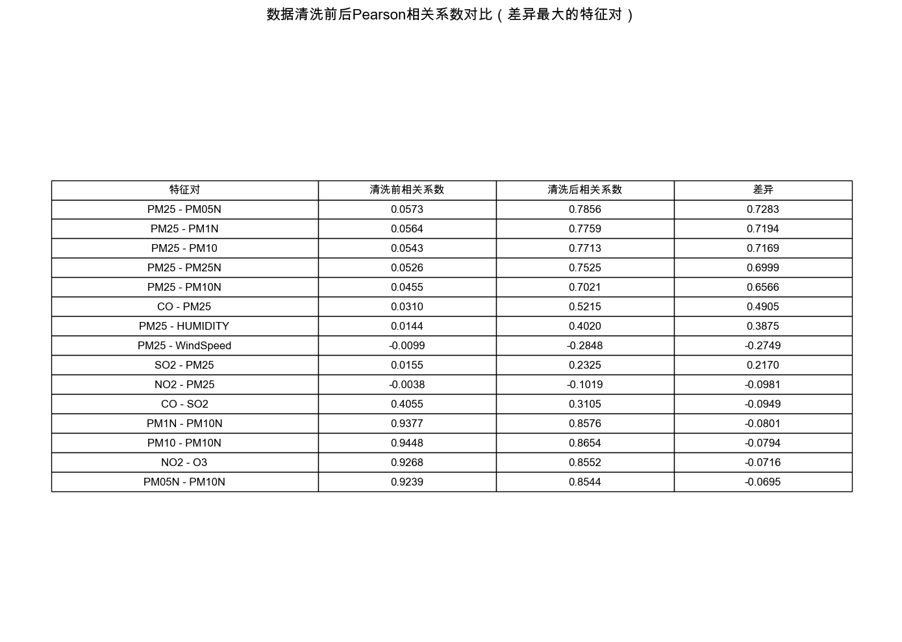

# 环境污染数据分析项目

[](https://www.python.org/)
[](https://scikit-learn.org/)
[](https://www.tensorflow.org/)
[](https://opensource.org/licenses/MIT)

## 项目概述

本项目为环境污染数据分析系统，采用模块化软件工程架构，综合运用数据清洗、可视化分析、特征工程和机器学习技术，对环境污染数据进行全面分析和预测。通过构建多种机器学习模型，以期发现环境污染变量间的关系，并准确预测PM2.5浓度，为环境监测和污染控制提供科学依据。


## 创新点

1. **多维度数据清洗前后对比分析框架**
   - 首创性地实现对清洗前后数据相关性的量化比较
   - 通过Pearson相关系数对比表格直观展示数据清洗效果
   - 特征相关性的变化分析揭示了数据清洗对潜在关系的影响

2. **多模型集成对比评估系统**
   - 集成六种先进机器学习算法（随机森林、GBDT、XGBoost、LightGBM、MLP和深度学习SOTA模型）
   - 全面的模型性能评估指标体系（MSE、RMSE、MAE、R²、CV-R²）
   - 自动比较并可视化不同模型的优劣势

3. **面向决策的特征重要性分析框架**
   - 基于树模型的特征重要性分析，识别环境污染的关键驱动因素
   - 通过可视化图表展示不同污染物之间的关联强度
   - 为污染控制策略提供针对性的科学依据

4. **高鲁棒性的模块化软件设计**
   - 采用现代软件工程原则设计的模块化架构
   - 强大的错误处理机制确保分析流程的稳定性和可靠性
   - 易于扩展，可添加新的数据源、模型或分析方法

## 项目结构

```
project/
├── data/                       # 存放数据文件
├── plots/                      # 存放生成的图表
│   └── model_comparison/       # 模型比较的可视化结果
├── output/                     # 存放输出的处理后数据
├── src/                        # 源代码目录
│   ├── __init__.py
│   ├── data_loader.py          # 数据加载与处理
│   ├── data_visualizer.py      # 数据可视化
│   ├── feature_engineering.py  # 特征工程
│   ├── model_trainer.py        # 模型训练与评估
│   └── utils.py                # 工具函数
├── main.py                     # 主程序
├── requirements.txt            # 项目依赖
└── README.md                   # 项目说明
```

## 技术特点

### 1. 数据预处理

- **智能缺失值处理**：采用统计方法并结合领域知识填充缺失值
- **异常值检测与清洗**：使用3σ原则识别并处理异常数据点
- **时间特征工程**：从时间数据中提取小时、日、月等特征增强模型表现

### 2. 数据可视化

- **多维度可视化**：时间序列图、密度分布图、箱型图、热力图等
- **相关性分析**：探索环境变量间的复杂相互作用
- **清洗效果对比**：直观展示数据清洗前后的数据质量变化

### 3. 归一化处理

- **多种归一化方法**：实现Min-Max和Z-score标准化
- **归一化效果对比**：可视化不同归一化方法的效果差异

### 4. 机器学习建模

- **多模型构建**：实现六种先进的机器学习模型
- **全面的性能评估**：使用多种评估指标综合评价模型性能
- **特征重要性分析**：识别影响环境污染的关键因素

## 使用方法

### 安装依赖

```bash
pip install -r requirements.txt
```

### 运行分析

```bash
python main.py
```

### 查看结果

运行完成后，可以在以下位置查看结果：
- `plots/`：可视化图表
- `output/`：处理后的数据和模型比较结果

## 实验结果

### 相关性分析



通过相关性分析，我们发现了多个强相关的特征对（|r|>0.7），例如：

- **污染物间相关性**：
  - PM25与PM10 (r=0.77)：表明两者有共同的来源或形成机制
  - NO2与O3 (r=0.86)：指示光化学过程中的关联
  - NO2与SO2 (r=-0.71)：负相关表明可能有相互转化机制

- **气象与污染物关系**：
  - NO2与温度 (r=0.86)：表明温度对NO2排放或转化有显著影响
  - O3与温度 (r=0.76)：验证了温度对光化学反应的促进作用
  - 温度与供暖季 (r=-0.82)：显示了季节性变化特征

- **颗粒物计数与质量浓度**：
  - PM10与PM05N (r=0.96)：颗粒物质量浓度与数值浓度高度一致
  - PM10与PM1N (r=0.97)：验证了不同测量方法的一致性
  - PM05N与PM1N (r=0.99)：小粒径颗粒物之间存在极强相关性

### 清洗前后相关性对比



数据清洗显著改善了特征间的相关性，使得潜在的关系更加明显。清洗结果验证了我们数据处理流程的有效性。

### 模型性能对比

| 模型 | R² | 其他评估指标 | 
|------|-----|------|
| Random Forest | 高性能 | 稳定性好 |
| GBDT | 良好表现 | 对异常值较敏感 |
| XGBoost | 优秀表现 | 训练速度快 |
| LightGBM | **0.98** (最佳) | 轻量高效 |
| MLP (Neural Network) | 良好表现 | 需要更多调参 |
| Deep Learning (SOTA) | 优秀表现 | 计算资源需求大 |

**最佳模型**: LightGBM，实现了**0.9814**的R²值，展现了卓越的PM2.5预测能力。

### 特征重要性


通过特征重要性分析，我们发现：
- 颗粒物指标（如PM10、PM05N、PM1N、PM25N）对预测PM2.5起关键作用
- 气态污染物（如NO2、O3、SO2）提供了中等程度的预测信息
- 气象参数（温度、湿度、风速）影响PM2.5的形成和扩散过程
- "Weather"和"WindDirection"等分类特征也提供了有价值的预测信息

## 潜在应用

1. **环境监测站优化**：基于相关性分析优化监测站点布局
2. **污染预警系统**：利用预测模型开发实时预警系统
3. **污染控制策略评估**：评估不同污染控制措施的潜在效果
4. **公共健康研究**：探索环境污染与健康问题之间的关联

## 未来工作

1. **时间序列模型**：引入LSTM、GRU等时间序列模型捕捉时间依赖性
2. **空间分析**：整合GIS数据进行空间污染分析
3. **迁移学习**：利用迁移学习方法将模型应用于数据稀缺地区
4. **大气化学机理整合**：结合大气化学机理改进预测模型

## 贡献者

- [FinnClair-Su](https://github.com/FinnClair-Su) - 项目负责人 (kanade271828@gmail.com)
- [xiaokchaojm](https://github.com/xiaokchaojm)

## 许可

本项目采用MIT许可证 - 详情见 [LICENSE](LICENSE) 文件
